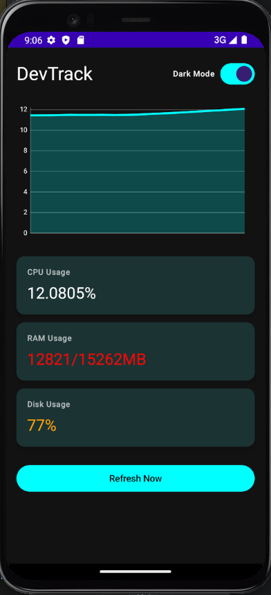
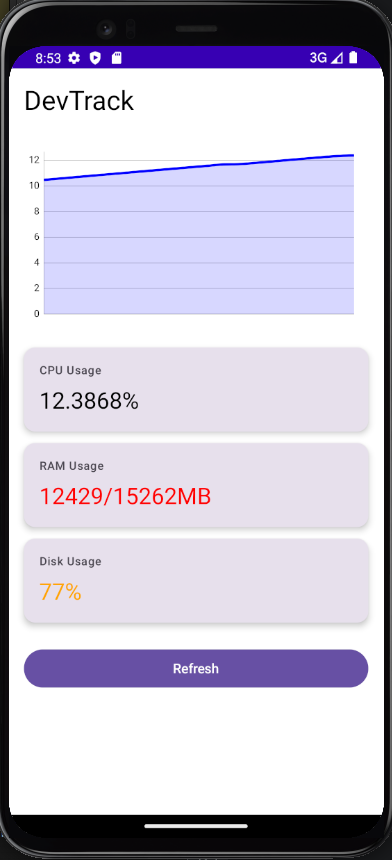

# 🚀 DevTrack — Full Stack System Monitor

DevTrack is a full-stack monitoring system that tracks **CPU, RAM, and Disk usage in real-time** using a Node.js backend and an Android app built with Jetpack Compose.

---

## 📱 App Preview

### 🌙 Dark Mode

### ☀️ Light Mode

---

## 📊 Features

- 📡 Real-time system monitoring (CPU, RAM, Disk)
- 📱 Android app with modern UI (Jetpack Compose)
- 📈 Live CPU graph
- 🌗 Dark / Light mode toggle
- 🔄 Auto-refresh every 5 seconds
- 🌐 Backend deployed on Render
- 🐳 Dockerized backend

---

## 🧱 Architecture

Android App (Kotlin + Compose)
↓
Retrofit API Calls
↓
Node.js + Express Backend
↓
Shell Scripts (CPU / RAM / Disk)

---

## 📡 API Endpoints

| Endpoint | Description |
| -------- | ----------- |
| `/cpu`   | CPU usage   |
| `/ram`   | RAM usage   |
| `/disk`  | Disk usage  |

---

## 🛠 Tech Stack

### Android

- Kotlin
- Jetpack Compose
- ViewModel
- Retrofit

### Backend

- Node.js
- Express.js
- Docker
- Shell scripting

---

## 📂 Project Structure

DevTrack/
├── android-app/
├── backend/
├── img/
└── README.md

---

## 👨‍💻 Author

Shivam
