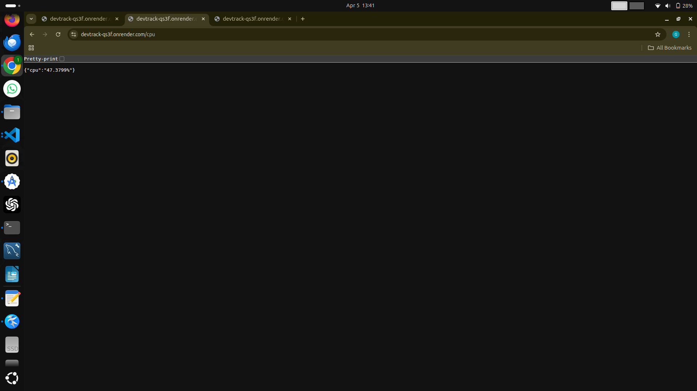
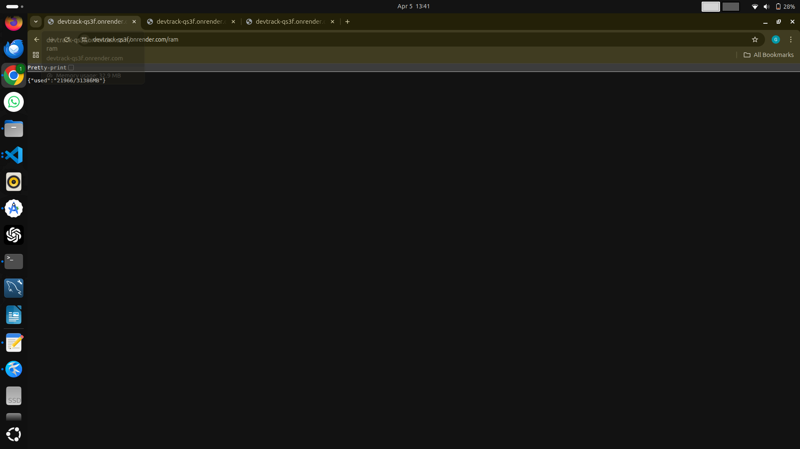
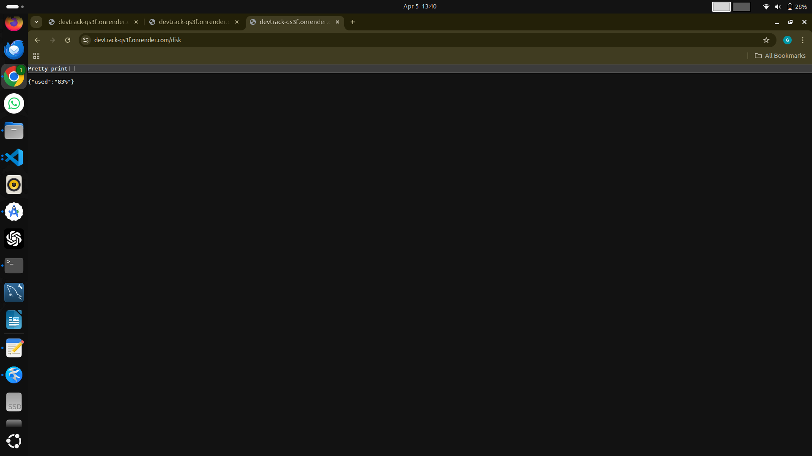

# 🖥 DevTrack Backend

Backend service built with Node.js and Express that provides real-time system metrics using shell scripts.

---

## 📡 API Endpoints

## 📡 API Response Preview

### 🔹 /cpu



---

### 🔹 /ram



---

### 🔹 /disk



```bash
npm install
node server.js
```

---

## 🐳 Docker Setup

```bash
docker build -t devtrack .
docker run -p 3000:3000 devtrack
```

---

## 🌍 Deployment (Render)

- Uses dynamic port:

```js
const PORT = process.env.PORT || 3000;
```

- Start command:

```bash
node server.js
```

---

## 📂 Folder Structure

backend/
├── scripts/
├── server.js
├── package.json
└── Dockerfile

---

## 🧠 How It Works

1. Express server receives API request
2. Executes shell script using `child_process.exec`
3. Captures output
4. Sends JSON response

---
